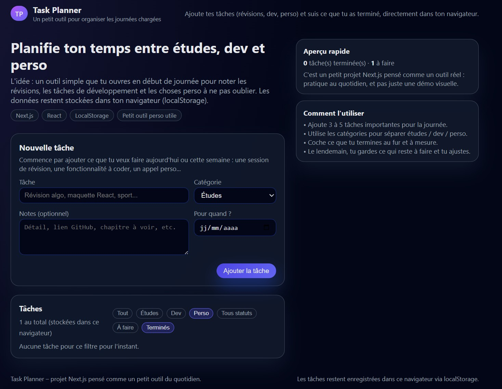

# Task Planner – Application d’organisation quotidienne

Ce projet est une petite application développée avec **Next.js** pour organiser sa journée simplement.  
Elle permet d’ajouter des tâches, de les catégoriser et de suivre ce qui a été fait ou non.  
Tout fonctionne directement dans le navigateur grâce au stockage local.

---

## Aperçu

Ajoutez une capture d’écran nommée `capture01.png` à la racine du projet pour qu’elle s’affiche ici :



---

## Fonctionnement

L’objectif du projet est de proposer un outil léger et rapide pour planifier ses priorités du jour :

- Ajouter une tâche avec un titre
- Choisir une catégorie (Études, Développement, Personnel)
- Ajouter une date ou des notes si nécessaire
- Marquer une tâche comme terminée ou la supprimer
- Filtrer facilement ce qu’on veut voir

Les données sont enregistrées en **localStorage**, ce qui permet de garder sa liste même après fermeture du navigateur.

---

## Structure du code

Le projet utilise **Next.js 14** avec l’App Router :

```
app/
  page.tsx            — page principale
  globals.css         — styles globaux

components/
  TaskForm.tsx        — formulaire d’ajout
  TaskList.tsx        — affichage des tâches
  TaskItem.tsx        — élément individuel
  FilterBar.tsx       — filtres
  useTasks.ts         — gestion du state + localStorage
```

---

## Installation

1. Installer les dépendances :

```bash
npm install
```

2. Lancer en local :

```bash
npm run dev
```

3. Ouvrir l’application :  
http://localhost:3000

---

## Pourquoi ce projet ?

Il s’agit d’un petit outil personnel permettant de structurer ses journées rapidement,  
sans devoir utiliser une application externe.  
C’est aussi un bon moyen de pratiquer :

- l’organisation d’un projet Next.js  
- l’utilisation des hooks et du state  
- l’intégration avec le stockage local  
- la création d’une interface moderne et simple

---

## Licence

Projet personnel, libre d’utilisation.
